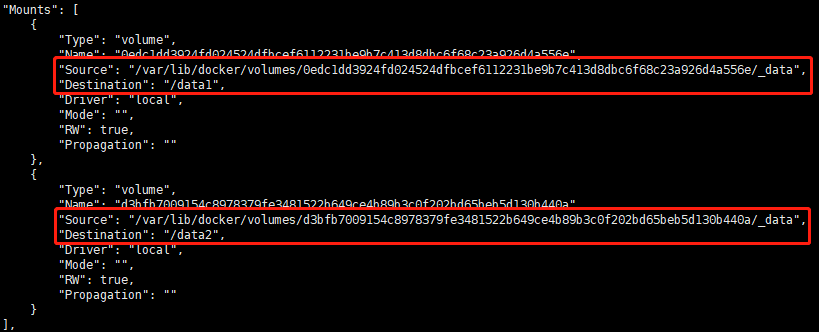

# [Docker] Dockerfile 使用

[TOC]


## Dockerfile 指令

Dockerfile 由一行行命令语句组成，并且支持以 `#` 开头的注释行。

一般的，**Dockerfile** 分为四部分：**基础镜像信息**、**维护者信息**、**镜像操作指令**和**容器启动时执行指令**。

> **Dockerfile的指令是忽略大小写的，建议使用大写，使用 # 作为注释，每一行只支持一条指令**


### FROM

> 解释：基础的image，表示新程序基于哪个image构建新image
> 用法：`FROM <image>:<tag>`

一开始必须指明所基于的镜像名称, **第一条指令必须为 FROM 指令**

```dockerfile
# 基于 python
FROM python
```


### MAINTAINER [`弃用 转 Label`]

>解释：维护者信息
>用法：`MAINTAINER <author>`

```dockerfile
# 标注维护者信息
MAINTAINER cdmin207078@gmail.com
# 新的定义方法，参考 LABEL 指令
LABEL maintainer="cdmin207078@gmail.com"
```


### LABEL

> 解释：镜像的元数据
> 用法：`LABEL <key>=<value> <key>=<value> <key>=<value> ...`

LABEL 采用键值对形式设置

```dockerfile
# 一行定义一个
LABEL "com.example.vendor"="ACME Incorporated"
LABEL com.example.label-with-value="foo"
LABEL version="1.0"
# 多个在一行定义
LABEL multi.label1="value1" multi.label2="value2" other="value3"
# 多行情况时，使用 \ 换行
LABEL description="This text illustrates \
that label-values can span multiple lines."
```

可以使用 `docker inspect` 命令查看 image 设置的元数据信息，如下：

```json
"Labels": {
    "com.example.vendor": "ACME Incorporated"
    "com.example.label-with-value": "foo",
    "version": "1.0",
    "description": "This text illustrates that label-values can span multiple lines.",
    "multi.label1": "value1",
    "multi.label2": "value2",
    "other": "value3"
},
```


### RUN

> 解释：运行任何被基础image支持的命令
> 用法：`RUN <command>` 或 `RUN ["executable","command-1","command-2"]`

常用于接受命令作为参数并用于安装软件包，创建镜像。
**不像CMD命令，RUN命令用于创建镜像** , 每条 RUN 指令将在当前镜像基础上执行指定命令，并提交为新的镜像。
当命令较长时可以使用 \ 来换行。

```dockerfile
# 执行屏幕输出
RUN echo 'hello RUN.'
# 换种方式
RUN ["/bin/bash","-c","echo hello RUN."]
..
# 安装软件包，多行
RUN 
```


### CMD

> 解释：启动容器时执行的命令
> 用法：`CMD [“executable”,”param1″,”param2″]`
>
> ​	     `CMD command param1 param2`
>
> ​             `CMD [”param1″,”param2″]`

**每个 Dockerfile 只能有一条 CMD 命令。如果指定了多条命令，只有最后一条会被执行。如果用户启动容器时候指定了运行的命令，则会覆盖掉 CMD 指定的命令。**

```dockerfile
#
CMD "echo" "Hello docker!"
```


### ENTRYPOINT

> 解释：容器启动后执行的命令 
> 用法：`ENTRYPOINT ["executable", "param1", "param2"]` - exec 形式, (**推荐**)
> 	     `ENTRYPOINT command param1 param2` - shell 形式

容器启动后执行的命令，并且不可被 docker run 提供的参数覆盖。
**每个 Dockerfile 中只能有一个 ENTRYPOINT ，当指定多个时，只有最后一个起效。**

该指令的使用分为两种情况， 一种是独自使用。当独自使用时，如果你还使用了CMD命令且CMD是一个完整的可执行的命令，那么CMD指令和ENTRYPOINT会互相覆盖只有最后一个CMD或者ENTRYPOINT有效，例如：

```dockerfile
# CMD指令将不会被执行，只有ENTRYPOINT指令被执行  
CMD echo “Hello, World!”  
ENTRYPOINT ls -l  
```


另一种用法和CMD指令配合使用来指定ENTRYPOINT的默认参数，这时CMD指令不是一个完整的可执行命令，仅仅是参数部分；ENTRYPOINT指令只能使用JSON方式指定执行命令，而不能指定参数。

```dockerfile
FROM ubuntu  
CMD ["-l"]  
ENTRYPOINT ["/usr/bin/ls"]  
```


### EXPOSE

> 解释：容器暴露的端口
> 用法：`EXPOSE <port> [<port>...]`

```dockerfile
# mysql 默认需要暴露3306端口
EXPOSE 3306
# Apache
EXPOSE 80
# MongoDB
EXPOSE 27017
# 多个端口
EXPOSE 9001 9002 9003
...
# 默认开启 TCP,可以手动指定开启哪个
EXPOSE 80/UDP
EXPOSE 80/TCP
```


### VOLUME

> 解释：创建一个镜像默认挂载点 
> 用法：`VOLUME /data`
>
> ​	    `VOLUME ["/data"]`

将容器有需要的目录，挂载到默认宿主机的默认卷位置。例如：数据库容器的数据位置，应用程序的日志保存位置

通过dockerfile的 VOLUME 指令可以在镜像中创建挂载点，这样只要通过该镜像创建的容器都有了挂载点。
通过 VOLUME 指令创建的挂载点，无法指定主机上对应的目录，是自动生成的。
**要想自定义挂载位置，可在容器运行时 使用 `-v <source>:<destination>` 指定** 

```dockerfile
FROM ubuntu
MAINTAINER hello1
VOLUME ["/data1","/data2"]
```

上面的dockfile文件通过VOLUME指令指定了两个挂载点 /data1 和 /data2.
我们通过docker inspect 查看通过该dockerfile创建的镜像生成的容器，可以看到如下信息



> 延伸阅读：
>
> [Docker Volume入门介绍 - 掘金](http://www.dockerinfo.net/1857.html)
>
> [Volume 使用 - 官网](https://docs.docker.com/storage/volumes/)
>
> [Dockerfile 指令 VOLUME 介绍 - 博客园](http://www.cnblogs.com/51kata/p/5266626.html)


### WORKDIR

> 解释：设置后续指令工作目录 
> 用法：`WORKDIR </path>`

为后续的 RUN  / CMD / ENTRYPOINT  / COPY / ADD  指令配置工作目录
可以使用多个 WORKDIR 指令，后续命令如果参数是相对路径，则会基于之前命令指定的路径。

```dockerfile
# 多次设置工作目录, 最终定位到的工作目录为 /a/b/c
WORKDIR /a
WORKDIR b
WORKDIR c
RUN pwd
```


### COPY

> 解释：复制本地主机的目录到目标容器系统中
> 用法：`COPY <src> <dest>`

**当使用本地目录为源目录时，推荐使用 COPY。**

```dockerfile
# 复制 "test" 到 `WORKDIR`/relativeDir/
COPY test relativeDir/
# 复制 "test" 到 /absoluteDir/
COPY test /absoluteDir/
# 正则匹配复制文件
COPY check* /testdir/           
COPY check?.log /testdir/
```

**COPY 命令区别于 ADD 命令的一个用法是在 multistage 场景下。**
关于 multistage 的介绍和用法请参考笔者的《[Dockerfile 中的 multi-stage](https://www.cnblogs.com/sparkdev/p/8508435.html)》一文。在 multistage 的用法中，可以使用 COPY 命令把前一阶段构建的产物拷贝到另一个镜像中，比如：

```dockerfile
FROM golang:1.7.3
WORKDIR /go/src/github.com/sparkdevo/href-counter/
RUN go get -d -v golang.org/x/net/html
COPY app.go    .
RUN CGO_ENABLED=0 GOOS=linux go build -a -installsuffix cgo -o app .

FROM alpine:latest
RUN apk --no-cache add ca-certificates
WORKDIR /root/
COPY --from=0 /go/src/github.com/sparkdevo/href-counter/app .
CMD ["./app"]
```

这段代码引用自《[Dockerfile 中的 multi-stage](https://www.cnblogs.com/sparkdev/p/8508435.html)》一文，其中的 COPY 命令通过指定 --from=0 参数，把前一阶段构建的产物拷贝到了当前的镜像中。

> 延伸阅读：[Dockerfile 中的 COPY 与 ADD 命令](https://www.cnblogs.com/sparkdev/p/9573248.html)


### ADD

> 解释：从源系统的文件系统上复制文件到目标容器的文件系统
> 用法：`ADD <src directory or URL> <destination directory>`

与 **COPY** 指令相比具有有以下两个特点：

**如果源是一个URL，那该URL的内容将被下载并复制到容器中。**
**如果源是一个tar文件，则会自动解压为目录。**

```dockerfile
# 复制 "test" 到 `WORKDIR`/relativeDir/
ADD test relativeDir/
# 复制 "test" 到 /absoluteDir/
ADD test /absoluteDir/
# 正则匹配复制文件
ADD hom* /mydir/
ADD hom?.txt /mydir/
```

**COPY** 命令是为最基本的用法设计的，概念清晰，操作简单。而 **ADD** 命令基本上是 COPY 命令的超集(除了 multistage 场景)，可以实现一些方便、酷炫的拷贝操作。

> 延伸阅读：[Dockerfile 中的 COPY 与 ADD 命令](https://www.cnblogs.com/sparkdev/p/9573248.html)


### ENV

> 解释：设置环境变量
> 用法：`ENV <key> <value>` 或 `ENV <key>=<value> ...`

```dockerfile
# 单个定义
ENV JAVA_HOME /usr/local/java8
# 多个定义
ENV SERVER_WORKS=4 SERVER_IP=192.168.0.1
# 值带空格 & 换行
ENV myName="John Doe" myDog=Rex\ The\ Dog \
    myCat=fluffy
```


### USER

> 解释：设置运行容器的UID
> 用法：`USER <user>[:<group>]`
> 	     `USER <UID>[:<GID>]`

设置启动容器的用户，默认是root用户。指定 memcached 的运行用户daemon

```dockerfile
# 指定memcached的运行用户  
ENTRYPOINT ["memcached"]  
USER daemon  
或  
ENTRYPOINT ["memcached", "-u", "daemon"]  
```


## Dockerfile实例 


## 构建镜像


## 参考

[Dockerfile reference - Official Website](https://docs.docker.com/engine/reference/builder/#from)

[创建自己的docker及Dockerfile语法 - 掘金](https://juejin.im/entry/5a5f367cf265da3e3f4cb88c)

[dockerfile 介绍 - 博客园](https://www.cnblogs.com/boshen-hzb/p/6400272.html)

[Dockerfile入门介绍 - dockerinfo.net](http://www.dockerinfo.net/695.html)