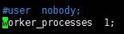

# docker nginx

[TOC]

## Nginx

Nginx是一款轻量级的Web服务器、反向代理服务器，由于它的内存占用少，启动极快，高并发能力强，在互联网项目中广泛应用。


> 上图基本上说明了当下流行的技术架构，其中Nginx有点入口网关的味道。


### 反向代理服务器

经常听人说到一些术语，如反向代理，那么什么是反向代理，什么又是正向代理呢？

**正向代理**


> 由于防火墙的原因，我们并不能直接访问谷歌，那么我们可以借助VPN来实现，这就是一个简单的正向代理的例子。这里你能够发现，**正向代理“代理”的是客户端**，而且客户端是知道目标的，而目标是不知道客户端是通过VPN访问的。


**反向代理**


> 当我们在外网访问百度的时候，其实会进行一个转发，代理到内网去，这就是所谓的反向代理，即**反向代理“代理”的是服务器端**，而且这一个过程对于客户端而言是透明的。


### Nginx的Master-Worker模式


启动Nginx后，其实就是在80端口启动了Socket服务进行监听，如图所示，Nginx涉及Master进程和Worker进程。


Master进程的作用是？

**读取并验证配置文件nginx.conf；管理worker进程；**

Worker进程的作用是？

**每一个Worker进程都维护一个线程（避免线程切换），处理连接和请求；注意Worker进程的个数由配置文件决定，一般和CPU个数相关（有利于进程切换），配置几个就有几个Worker进程。**




### 思考一：Nginx如何做到热部署

所谓热部署，就是配置文件nginx.conf修改后，不需要stop Nginx，不需要中断请求，就能让配置文件生效！（`nginx -s reload` 重新加载 `/nginx -t`检查配置 `/nginx -s` stop）

通过上文我们已经知道worker进程负责处理具体的请求，那么如果想达到热部署的效果，可以想象：

- 方案一：修改配置文件nginx.conf后，主进程master负责推送给woker进程更新配置信息，woker进程收到信息后，更新进程内部的线程信息。（有点valatile的味道）
- 方案二：修改配置文件nginx.conf后，重新生成新的worker进程，当然会以新的配置进行处理请求，而且新的请求必须都交给新的worker进程，至于老的worker进程，等把那些以前的请求处理完毕后，kill掉即可。

**Nginx是采用方案二来达到热部署的**


### 思考二：Nginx如何做到高并发下的高效处理？

上文已经提及Nginx的worker进程个数与CPU绑定、worker进程内部包含一个线程高效回环处理请求，这的确有助于效率，但这是不够的。

**作为专业的程序员，我们可以开一下脑洞：BIO/NIO/AIO、异步/同步、阻塞/非阻塞...**

要同时处理那么多的请求，要知道，有的请求需要发生IO，可能需要很长时间，如果等着它，就会拖慢worker的处理速度。

**Nginx采用了Linux的epoll模型，epoll模型基于事件驱动机制，它可以监控多个事件是否准备完毕，如果OK，那么放入epoll队列中，这个过程是异步的。worker只需要从epoll队列循环处理即可。**


### 思考三：Nginx挂了怎么办？

Nginx既然作为入口网关，很重要，如果出现单点问题，显然是不可接受的。

答案是：**Keepalived+Nginx实现高可用**。

Keepalived是一个高可用解决方案，主要是用来防止服务器单点发生故障，可以通过和Nginx配合来实现Web服务的高可用。（其实，Keepalived不仅仅可以和Nginx配合，还可以和很多其他服务配合）

Keepalived+Nginx实现高可用的思路：

1. 请求不要直接打到Nginx上，应该先通过Keepalived（这就是所谓虚拟IP，VIP）
2. Keepalived应该能监控Nginx的生命状态（提供一个用户自定义的脚本，定期检查Nginx进程状态，进行权重变化,，从而实现Nginx故障切换）


### nginx.conf


## docker 下 nginx 安装使用

下载镜像

```shell
[root@vultr docker-compose-wordpress]# docker pull nginx
```

启动脚本 **start-nginx.sh**

```shell
docker run \
-p 80:80 \
--name nginx \
-v $PWD/www:/www \
-v $PWD/conf/nginx.conf:/etc/nginx/nginx.conf \
-v $PWD/logs:/wwwlogs \
-d nginx
```

可能会遇到的错误：

```shell
[root@vultr docker-nginx]# ./start-nginx.sh 
89b9e70c0cf8215824eed6f9b8823ea16ba82c8c5ec50190aa17723115240aa4
docker: Error response from daemon: OCI runtime create failed: container_linux.go:344: starting container process caused "process_linux.go:424: container init caused \"rootfs_linux.go:58: mounting \\\"/usr/local/data/docker-nginx/conf/nginx.conf\\\" to rootfs \\\"/var/lib/docker/overlay2/94d95499bfea3bcf40d88745ff6ab104ee7e2efba5d530ce2b6fe0536f4e0469/merged\\\" at \\\"/var/lib/docker/overlay2/94d95499bfea3bcf40d88745ff6ab104ee7e2efba5d530ce2b6fe0536f4e0469/merged/etc/nginx/nginx.conf\\\" caused \\\"not a directory\\\"\"": unknown: Are you trying to mount a directory onto a file (or vice-versa)? Check if the specified host path exists and is the expected type.
```

**解决方法**

> 先复制一个nginx.conf文件出来，再重新创建nginx容器

```shell
# 启动一个临时nginx容器
[root@vultr docker-nginx] docker run --name tmp-nginx-container -d nginx
# 创建配置文件所在目录
[root@vultr docker-nginx] mkdir conf
# 复制nginx.conf 到宿主机目录 (之后正式启动使用此配置文件)
[root@vultr docker-nginx] docker cp tmp-nginx-container:/etc/nginx/nginx.conf $PWD/conf/nginx.conf
# 删除临时nginx容器
[root@vultr docker-nginx] docker rm -f tmp-nginx-container
# 启动正式nginx 容器
[root@vultr docker-nginx]# ./start-nginx.sh 
d2aa2b15810e925447905e265e67717de997381cd25bcf4ddbde92f16e004e15
# .. 启动成功
```


## 参考

[深入浅出Nginx](https://www.jianshu.com/p/5eab0f83e3b4)

[nginx in docker - docker 官方文档](https://docs.docker.com/samples/library/nginx/)

[[Docker安装nginx以及负载均衡](https://www.cnblogs.com/xishaohui/p/8871994.html)](http://www.cnblogs.com/xishaohui/p/8871994.html)