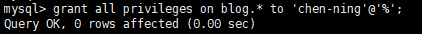

# [Docker] Mysql 安装使用


[TOC]

## 安装

查找镜像

```bash
[root@vultr ~]# docker search mysql
```


拉取镜像

```bash
[root@vultr ~]# docker pull mysql
```

启动容器

```bash
docker run \
-p 3306:3306 \
-v $PWD/conf/conf.d:/etc/mysql/conf.d \
-v $PWD/logs:/logs \
-v $PWD/data:/var/lib/mysql \
-e MYSQL_ROOT_PASSWORD=123456 \
-d mysql

# 可以将启动命令做成 .sh 启动文件
```

启动之后，就可以通过 `docker ps` 命令 查看已经启动的 *mysql* 容器


## 常见问题

### 外网不能访问

**原因一**: 

>  docker 主机端口未开放

首先排查docker 主机端口是否开放访问

[[Centos7 firewall开放3306端口](https://www.cnblogs.com/huizhipeng/p/10127333.html)](https://www.cnblogs.com/huizhipeng/p/10127333.html)

**原因二:** 

> Mysql 5.7 之后，系统数据库中用户表的用户密码字段从 `password` 变更为 `authentication_string`
> Mysql 8.0 之后，系统数据库中用户表的密码字段默认加密方式改为 `caching_sha2_password` 方式

**解决方法**

手动进入容器，访问Mysql，修改添加新用户，分配权限。

> 最好不要直接使用 root 来从外网访问数据库资源
>
> 若要使用 root 用户，则参考下方步骤，修改root 用户密码即可

**进入容器**


**访问mysql**


**新建用户**

```bash
mysql> create user "chen-ning"@"%" identified with mysql_native_password by '12345678';
```


**新建数据库**

```bash
mysql> create database if not exists blog default charset utf8 collate utf8_general_ci;
```


**用户数据库授权**

```mysql
# 将 blog 数据库所有权限, 全部赋予 'chen-ning'@'%' 用户
mysql> grant all privileges on blog.* to 'chen-ning'@'%';
```



[MySQL的Grant命令 - 参考链接](http://www.cnblogs.com/hcbin/archive/2010/04/23/1718379.html)

至此，外网客户端, 便可连上操作该数据库


## 参考

[Docker 安装 MySQL](http://www.runoob.com/docker/docker-install-mysql.html)

[MySQL8.0允许外部访问](https://blog.csdn.net/h996666/article/details/80921913)

[MySQL的Grant命令](http://www.cnblogs.com/hcbin/archive/2010/04/23/1718379.html)

