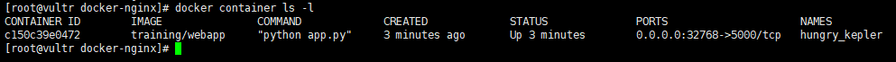
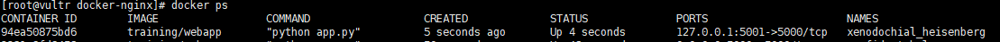
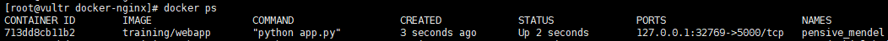
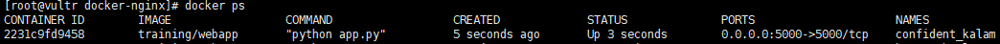
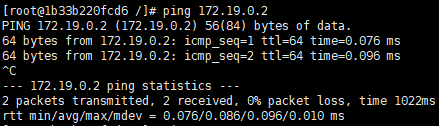
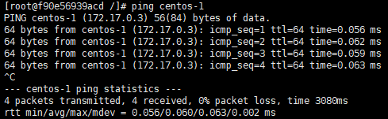
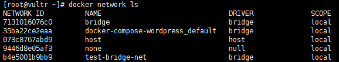
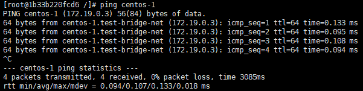

# Docker 网络

[TOC]

Docker 允许通过外部访问容器或容器互联的方式来提供网络服务


## 外部访问容器

容器中可以运行一些网络应用，要让外部也可以访问这些应用，可以通过 **-P**`(大写)` 或 **-p**`(小写)` 参数来指定端口映射。

- 当使用 **-P**`(大写)` 标记时，Docker 会随机映射一个端口到内部容器开放的网络端口。

  ```shell
  # -P 随机映射一个端口到容器暴露的端口
  [root@vultr docker-nginx]# docker run -d -P training/webapp python app.py
  
  # 查看容器详情
  [root@vultr docker-nginx]# docker container ls -l
  ```

  

  

- 当使用 **-p**`(小写)` 则可以指定要映射的端口，并且，在一个指定端口上只可以绑定一个容器。支持的格式有 

  1. **ip:hostPort:containerPort** - 映射到指定地址的指定端口

     ```shell
     [root@vultr docker-nginx]# docker run -d -p 127.0.0.1:5001:5000 training/webapp python app.py
     94ea50875bd62f1a0c0e73e2c6e4f75ef263918b0b13402c32d3a4975041028c
     ```

     
     
2. **ip::containerPort** - 映射到指定地址的任意端口
  
   ```shell
     [root@vultr docker-nginx]# docker run -d -p 127.0.0.1::5000 training/webapp python app.py
     713dd8cb11b2c35936632c49a80875f491a9a3080b037378fd04613038e889b2
   ```
  
   
  
   这种情况下，只能指定的ip 才能够访问，  适用于多网卡情况，比如：只允许内网访问
  
   
  
3. **hostPort:containerPort** - 映射所有接口地址
  
   ```shell
     [root@vultr docker-nginx]# docker run -d -p 5000:5000 training/webapp python app.py
     2231c9fd9458910ce85f70058b8f28557004576fea899b70454fea5abca0df2e
   ```
  
   


**查看映射端口配置**

使用 **docker port** 来查看当前映射的端口配置，也可以查看到绑定的地址

```shell
[root@vultr docker-nginx]# docker port 713dd8cb11b2
5000/tcp -> 127.0.0.1:32769
```

> 容器有自己的内部网络和 ip 地址 (使用 docker inspect 可以获取所有的变量，Docker
> 还可以有一个可变的网络配置)

**-p 标记可以多次使用来绑定多个端口**

```shell
$ docker run -d \
-p 5000:5000 \
-p 3000:80 \
training/webapp \
python app.py
```


## 容器互联

### 虚拟ip访问

安装docker时，docker会默认创建一个内部的桥接网络docker0，每创建一个容器分配一个虚拟网卡，容器之间可以根据ip互相访问。

```shell
[root@vultr ~]# ifconfig
...
docker0: flags=4163<UP,BROADCAST,RUNNING,MULTICAST>  mtu 1500
        inet 172.17.0.1  netmask 255.255.0.0  broadcast 172.17.255.255
        inet6 fe80::42:7fff:fe5a:3c9  prefixlen 64  scopeid 0x20<link>
        ether 02:42:7f:5a:03:c9  txqueuelen 0  (Ethernet)
        RX packets 14001  bytes 9571444 (9.1 MiB)
        RX errors 0  dropped 0  overruns 0  frame 0
        TX packets 21851  bytes 50360088 (48.0 MiB)
        TX errors 0  dropped 0 overruns 0  carrier 0  collisions 0
...
```

运行两个centos镜像，分别查看各自 IP

```shell
# 启动 centos-1 容器
[root@vultr ~]# docker run -it --name centos-1 docker.io/centos:latest
[root@ae9fd45a8ff4 /]# ifconfig
...
eth0: flags=4163<UP,BROADCAST,RUNNING,MULTICAST>  mtu 1500
        inet 172.19.0.3  netmask 255.255.0.0  broadcast 172.19.255.255
        ether 02:42:ac:13:00:03  txqueuelen 0  (Ethernet)
        RX packets 5040  bytes 12563211 (11.9 MiB)
        RX errors 0  dropped 0  overruns 0  frame 0
        TX packets 2530  bytes 170301 (166.3 KiB)
        TX errors 0  dropped 0 overruns 0  carrier 0  collisions 0
...

# 启动 centos-2 容器
[root@vultr ~]# docker run -it --name centos-2 docker.io/centos:latest
[root@1b33b220fcd6 /]# ifconfig
...
eth0: flags=4163<UP,BROADCAST,RUNNING,MULTICAST>  mtu 1500
        inet 172.19.0.2  netmask 255.255.0.0  broadcast 172.19.255.255
        ether 02:42:ac:13:00:02  txqueuelen 0  (Ethernet)
        RX packets 5080  bytes 12564713 (11.9 MiB)
        RX errors 0  dropped 0  overruns 0  frame 0
        TX packets 2963  bytes 200181 (195.4 KiB)
        TX errors 0  dropped 0 overruns 0  carrier 0  collisions 0
...

```

容器内部ping测试结果如下：




> 总结：这种方式必须知道每个容器的ip，在实际使用中并不实用。

### link

运行容器的时候加上参数link

运行第一个容器

```shell
[root@vultr ~]# docker run -it --name centos-1 docker.io/centos:latest
```

运行第二个容器

```shell
[root@vultr ~]# docker run -it --name centos-2 --link centos-1:centos-1 docker.io/centos:latest
```

**--link**：参数中第一个centos-1是**容器名**，第二个centos-1是定义的**容器别名**（使用别名访问容器），为了方便使用，一般别名默认容器名。

从一个容器ping另外一个容器，测试结果如下：




> 总结： 此方法对容器创建的顺序有要求，如果集群内部多个容器要互访，使用就不太方便。

### 创建bridge网络

使用命令 **docker network create <网络名>** 来创建一个名为 **test-bridge-net** 的 **bridge** 网络

使用 **docker network ls** 命令，查看docker网络

```shell
[root@vultr ~]# docker network create test-bridge-net
b4e5001b9bb97c730144245760778d9ba1870af68d41cd72c5f1f1fff9631172
```




运行容器连接到 **test-bridge-net** 网络， 使用方法：**docker run --name <容器名> ---network <bridge> --network-alias <网络别名> <镜像名>**

```shell
# centos-1 容器
[root@vultr ~]# docker run -it --name centos-1 --network test-bridge-net --network-alias centos-1 docker.io/centos:latest
# centos-2 容器
[root@vultr ~]# docker run -it --name centos-2 --network test-bridge-net --network-alias centos-2 docker.io/centos:latest
```

最后，从一个容器ping另外一个容器，测试结果如下：




## 参考

[Docker容器互访三种方式](https://www.cnblogs.com/shenh/p/9714547.html)