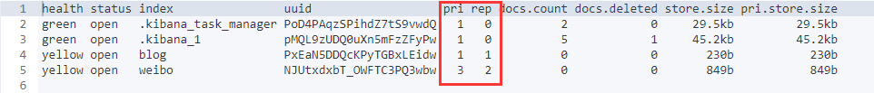

# ElasticSearch - Index 索引

[TOC]


本节讲述Elasticsearch 中的索引API。索引API 用于管理各个索引，索引设置，别名，映射和索引模板。


## 新建索引

**索引命名规范**

- 仅限小写字母

- 不能包含`\`、`/`、 `*`、`?`、`"`、`<`、`>`、`|`、#以及空格符等特殊符号

- 从7.0版本开始不再包含冒号

- 不能以`-`、`_`或`+`开头

- 不能超过255个字节（注意这里是字节，因此多字节字符将计入255个限制）

  

基本命令如下：

```
PUT weibo
```

结果

```json
{
  "acknowledged" : true,
  "shards_acknowledged" : true,
  "index" : "weibo"
}
```

上面这样，就创建了一个具有默认配置的名为 **weibo** 的索引。


## 索引配置

创建索引时，可以制定相关设置，比如设置索引的 分片数 **number_of_shards** 和 副本数**number_of_replicas**

**默认情况下 分片数(number_of_shards) 与 副本数 (number_of_replicas) 都是 1**

例子：创建一个名为 weibo 的索引，它具有 三个 分片，与 两个 副本

```sh
PUT weibo
{
    "settings" : {
        "index" : {
            "number_of_shards" : 3,
            "number_of_replicas" : 2
        }
    }
}
```

也可以简化为

```sh
PUT weibo
{
    "settings" : {
        "number_of_shards" : 3,
        "number_of_replicas" : 2
    }
}
```


## 查看索引

例子：查看名为 weibo 的索引

```sh
GET weibo
```

结果

```json
{
  "weibo" : {
    "aliases" : { },
    "mappings" : { },
    "settings" : {
      "index" : {
        "creation_date" : "1563809485541",
        "number_of_shards" : "3",
        "number_of_replicas" : "2",
        "uuid" : "NJUtxdxbT_OWFTC3PQ3wbw",
        "version" : {
          "created" : "7020099"
        },
        "provided_name" : "weibo"
      }
    }
  }
}
```


## 查看索引列表

```sh
GET /_cat/indices?v
```

结果如下，其中带有`.kibana`是Kibana自带样例索引。值得注意的是，新建的索引默认情况下 分片数(pri) 与 副本数 (rep) 都是 1




## 判断索引是否存在

```sh
HEAD weibo
```

结果

```sh
# 存在
200 - OK
# 不存在
404 - Not Found
```


## 更新副本数

```sh
PUT weibo/_settings
{
  "number_of_replicas": 5
}
```


## 更新分片数

> 索引分片数，不可修改

**尝试修改将会得到以下错误**

```sh
PUT weibo/_settings
{
  "number_of_shards": 5
}
```

结果

```json
{
  "error": {
    "root_cause": [
      {
        "type": "illegal_argument_exception",
        "reason": "Can't update non dynamic settings [[index.number_of_shards]] for open indices [[weibo/NJUtxdxbT_OWFTC3PQ3wbw]]"
      }
    ],
    "type": "illegal_argument_exception",
    "reason": "Can't update non dynamic settings [[index.number_of_shards]] for open indices [[weibo/NJUtxdxbT_OWFTC3PQ3wbw]]"
  },
  "status": 400
}
```

这是因为当索引一个文档的时候，文档会被存储到一个主分片中。 Elasticsearch 如何知道一个文档应该存放到哪个分片中呢？当我们创建文档时，它如何决定这个文档应当被存储在分片 `1` 还是分片 `2` 中呢？

首先这肯定不会是随机的，否则将来要获取文档的时候我们就不知道从何处寻找了。实际上，这个过程是根据下面这个公式决定的：

```
shard = hash(routing) % number_of_primary_shards
```

`routing` 是一个可变值，默认是文档的 `_id` ，也可以设置成一个自定义的值。 `routing` 通过 hash 函数生成一个数字，然后这个数字再除以 `number_of_primary_shards` （主分片的数量）后得到 **余数** 。这个分布在 `0` 到 `number_of_primary_shards-1` 之间的余数，就是我们所寻求的文档所在分片的位置。

这就解释了为什么我们要在创建索引的时候就确定好主分片的数量 并且永远不会改变这个数量：因为如果数量变化了，那么所有之前路由的值都会无效，文档也再也找不到了。

> 参考： https://www.elastic.co/guide/cn/elasticsearch/guide/current/routing-value.html


## 查看索引配置信息

```sh
GET weibo/_settings/
```

结果

```json
{
  "weibo" : {
    "settings" : {
      "index" : {
        "creation_date" : "1563809485541",
        "number_of_shards" : "3",
        "number_of_replicas" : "5",
        "uuid" : "NJUtxdxbT_OWFTC3PQ3wbw",
        "version" : {
          "created" : "7020099"
        },
        "provided_name" : "weibo"
      }
    }
  }
}
```


## 删除索引

```sh
DELETE weibo
```

结果

```json
{
  "acknowledged" : true
}
```


## 索引的关闭与打开

一个关闭的索引几乎不占用系统资源。我们可以临时关闭某个索引，在需要时再重新打开该索引。

```sh
# 关闭
POST weibo/_close

# 打开
POST weibo/_open
```


## 指定 type 的 mapping


## 索引别名

索引别名不仅仅可以关联一个索引，它能聚合多个索引。此外，一个别名也可以与一个过滤器相关联， 这个过滤器在搜索和路由的时候被自动应用。


## 参考

[Elasticsearch 7.x：2、索引管理 -csdn](https://blog.csdn.net/chengyuqiang/article/details/86000472)

