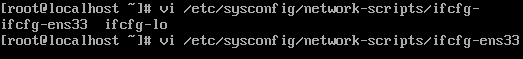
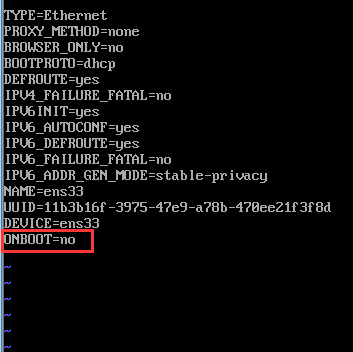

# yum安装软件提示 cannot find a valid baseurl for repobase7x86_64 

## 问题描述

> 虚拟机新装的 **CenterOS 7** 系统使用 **yum intall** 来安装包，报错 `cannot find a valid baseurl for repobase7x86_64`

**无法联网的明显表现会有**：

1. ping host 会提示 **unknown host**

   

2. **yum install** 出现 **Error: cannot find a valid baseurl or repo:base/7/x86_64**

## 解决方法

### 方法一

1. 打开 **vi /etc/sysconfig/network-scripts/ifcfg-ens33**（每个机子都可能不一样，但格式会是“ifcfg-eth/ens数字”），把**ONBOOT=no**，改为**ONBOOT=yes**

   

   

2. 重启网络：**service network restart**

### 方法二

// TODO

## 参考

[yum安装软件提示 cannot find a valid baseurl for repobase7x86_64 ](https://blog.csdn.net/liuxiao723846/article/details/81147658)