# Spring Boot 配置文件

[TOC]

## 1. 配置文件

Spring Boot 使用一个全局配置文件，用来修改 Spring Boot 底层自动配置的默认值，**配置文件名称是固定的**。

配置文件支持下面两种文件格式：

* application.properties
* application.yml


其中，properties 格式：

```properties
# application.properties
server.port=9090
```

yaml 格式：

```yaml
# application.yaml
server:
  port: 9090
```

或，之前 xml 格式：

```xml
<server>
	<port>9090</port>
</server>
```

## 2. YAML 语法

### 1.  基本语法

`<key>:[空格]<value>` 表示一对键值对，其中分隔冒号后面，value 前面的**空格必须有**

YAML 配置 以空格的缩进来控制层级关系，只要左对齐的一列数据，都是同一层级的

```yaml
# application.yaml
server:
  port: 9091
  error:
    path: /error
```

**注意：属性和值都是大小写敏感的**


### 2. 值的写法


#### 1. 字面量：普通的值 (数字，字符串，布尔)

字面量直接来写

其中，用 单引号 或 双引号包裹字符串字面量，会有不同效果，具体如下：

`" "`： 双引号：**不会转义字符串里的特殊符号，特殊字符会表示其本身含义**。例如：

```yaml
name: "hello \n world"
# == 输出 == 
# hello [换行↓]
# world
```

`' '`：单引号：**会转义字符串其中的特殊字符，特殊字符会当作普通字符串，原样输出**。例如：

```yaml
name: "hello \n world"
# == 输出 ==
# hello \n world
```

**默认情况下，字符串不需要加 单引号 或者 双引号**


#### 2. 对象，Map (键值对，属性和值)

当值为对象的时候，只需在key 的下一行来写对象的属性和值，注意保持缩进

```properties
user:
  name: 不凡
  age: 29
```

还有一种行内写法，二者效果一样：

```yaml
user: { name: 不凡, age: 29 }
```

#### 3.  数组

用 `-[空格][value]` 来表示数组中的一个元素，例如：

```yaml
pets:
 - cat
 - dog
 - fish
```

或 行内写法：

```yaml
pets: [cat, dog, fish]
```


## 3.  配置映射

创建自定义类

```java
/* Person.java */
public class Person {

    private String lastName;
    private Integer age;
    private Boolean boss;
    private Date birth;
    private Map<String, Object> maps;
    private List<Object> lists;
    private Dog dog;

    public String getLastName() {
        return lastName;
    }

    public void setLastName(String lastName) {
        this.lastName = lastName;
    }

    public Integer getAge() {
        return age;
    }

    public void setAge(Integer age) {
        this.age = age;
    }

    public Boolean getBoss() {
        return boss;
    }

    public void setBoss(Boolean boss) {
        this.boss = boss;
    }

    public Date getBirth() {
        return birth;
    }

    public void setBirth(Date birth) {
        this.birth = birth;
    }

    public Map<String, Object> getMaps() {
        return maps;
    }

    public void setMaps(Map<String, Object> maps) {
        this.maps = maps;
    }

    public List<Object> getLists() {
        return lists;
    }

    public void setLists(List<Object> lists) {
        this.lists = lists;
    }

    public Dog getDog() {
        return dog;
    }

    public void setDog(Dog dog) {
        this.dog = dog;
    }


    @Override
    public String toString() {
        return "Person{" +
                "lastName='" + lastName + '\'' +
                ", age=" + age +
                ", boss=" + boss +
                ", birth=" + birth +
                ", maps=" + maps +
                ", lists=" + lists +
                ", dog=" + dog +
                '}';
    }
}
```

```java
/* Dog.java */
public class Dog {
    private String name;
    private String age;

    public String getName() {
        return name;
    }

    public void setName(String name) {
        this.name = name;
    }

    public String getAge() {
        return age;
    }

    public void setAge(String age) {
        this.age = age;
    }

    @Override
    public String toString() {
        return "Dog{" +
                "name='" + name + '\'' +
                ", age='" + age + '\'' +
                '}';
    }
}
```


配置文件

```yaml
person:
  lastName: 不凡
  age: 29
  boss: false
  birth: 1990-08-08
  maps: { k1: v1, k2: v2}
  lists:
    - 东坡
    - 介甫
  dog:
    name: Dog
    age: 2
```

接下来，为了让配置文件中的配置，能被映射到 Person 对象上，则需要给 Person 添加注解，

`@ConfigurationProperties(prefix = "person")`

**@ConfigurationProperties** 注解用来告诉 Spring Boot 将本类中的所有属性和配置文件相关配置进行绑定，其中 **prefix = "person"** 参数指明使用配置文件中的哪个节点进行映射

并且，只有容器中的组件，才能使用容器提供的 @ConfigurationProperties 功能，所以须添加 **@Component** 注解

添加好注解Person 类整体如下：

```java
@Component
@ConfigurationProperties(prefix = "person")
public class Person {

    private String lastName;
    private Integer age;
    private Boolean boss;
    private Date birth;

    private Map<String, Object> maps;
    private List<Object> lists;
    private Dog dog;
}
```

------

**IDEA 注意**，若使用 IDEA 开发工具，可能会出现下图提示，表示 Spring Boot 配置注解处理器没有被配置到 **classpath**

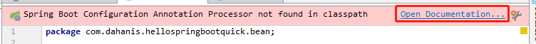

点击 Open Documentation 链接，跳转至 [Spring Boot 官网文档 Annotation Processor](https://docs.spring.io/spring-boot/docs/2.1.1.RELEASE/reference/html/configuration-metadata.html#configuration-metadata-annotation-processor) 按照说明，将 依赖添加至 项目 pom 文件中，如下：

```xml
/* pom.xml */
...
<dependencies>
    ...
    <dependency>
        <groupId>org.springframework.boot</groupId>
        <artifactId>spring-boot-configuration-processor</artifactId>
        <optional>true</optional>
    </dependency>
</dependencies>
...
```

依赖添加完毕之后，回到 Person 类中，上方红色提示变为绿色：

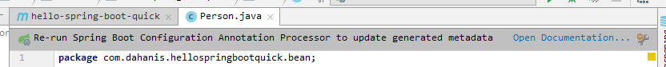

提示说明，重新运行Spring Boot 程序，以来更新以来配置

以后再在配置文件中书写配置，则会有智能提示，如下：

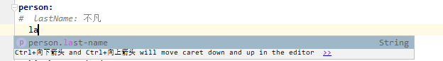

其中提示的 `last-name` 与 `lastName` 写法效果相等

------

最后，测试输出

```java
@RunWith(SpringRunner.class)
@SpringBootTest
public class HelloSpringBootQuickApplicationTests {
    
    @Autowired
    Person person;

    @Test
    public void contextLoads() {
        System.out.println(person);
    }
}
```

结果：

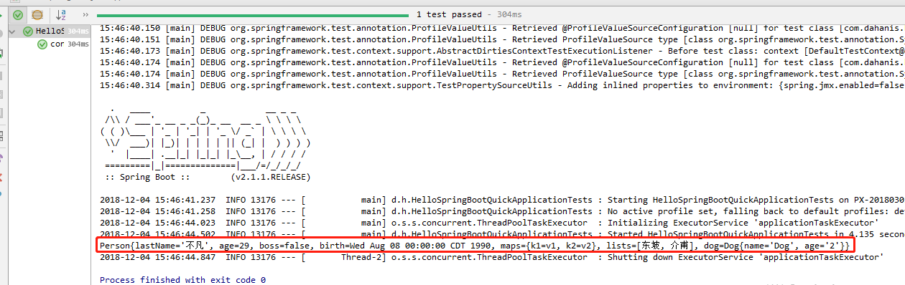


## 4. Properties 语法配置

```properties
# person 信息配置
person.last-name=张三
person.age=18
person.birth=2000/02/24
person.boss=true
person.dog.name=佩奇
person.dog.age=5
person.lists=乔治,苏西
person.maps.k1=小猪
person.maps.k2=Pig
```

结果 :

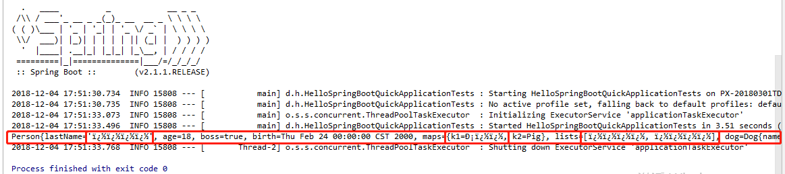

**注意**：出现这种情况时，表明所使用的 IDEA `.properties` 文件默认编码不是 `UTF-8`，设置一下默认编码格式即可， 具体设置方法如下：

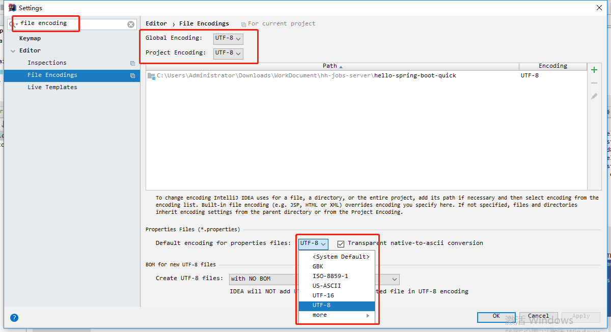

设置之后，结果如下：

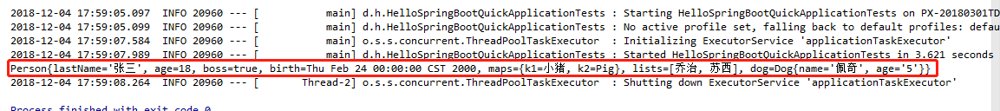


## 5. 使用 @Value 取值


```java
@Component
//@ConfigurationProperties(prefix = "person")
public class Person {

    /**
     * 获取配置文件中的属性配置
     */
    @Value("${person.last-name}")
    private String lastName;

    /**
     * 执行 SpEL 表达式
     */
    @Value("#{11*2}")
    private Integer age;
    
    ...
}
```

结果：

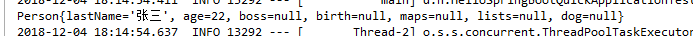

**@Value 取值与 @ConfigurationProperties 取值比较**

| Feature            | @ConfigurationProperties | @Value     |
| ------------------ | ------------------------ | :--------- |
| 指定方式           | 批量注入文件中的属性     | 一个个指定 |
| 松散绑定(松散语法) | 支持                     | 不支持     |
| SpEL               | 不支持                   | 支持       |
| JSR303数据校验     | 支持                     | 不支持     |
| 复杂类型封装       | 支持                     | 不支持     |

> 总结：
>
> 如果仅仅在某个业务逻辑中需要获取配置文件中的某个配置项，则使用 **@Value**
>
> 如果专门写了一个 JavaBean来和配置文件进行映射，则直接使用 **@ConfigurationProperties ** 更方便合适

---

**JSR303数据校验**

```java
@Component
@ConfigurationProperties(prefix = "person")
@Validated  // 新增启用校验注解
public class Person {

    /**
     * 获取配置文件中的属性配置
     */
    // @Value("${person.last-name}")
    // Email 格式校验
    @Email  
    private String lastName;
    ...
}
```

结果

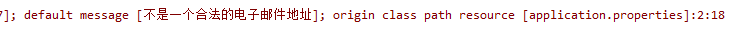

---

## 6 . @PropertySource

**@PropertySource** : 加载指定位置配置文件

```java
@PropertySource(value = {"classpath:person.properties"})
@Component
@ConfigurationProperties(prefix = "person")
public class Person {
	...
}
```

**注意** 使用指定配置文件时，须确保 `application.properties` 与 `application.yaml` 里面同样配置移出，否则则不会使用指定配置文件配置值


## 7. 配置文件占位符

### 1.随机数

```properties
${random.int}				=> (int)847758849
${random.long}				=> (long)6787244848983059766
${random.int[1024,65536]}	=> (37769)
${random.value}				=> '52fb500b1b7931c48c97d3ff997b70c7'
${random.int[1024,65536]}	=> '732f0531-3310-4878-bad6-221539ba984b'
```

### 2. 占位符获取之前配置的值

```properties
person.last-name=张三
person.age=18
person.dog.name=${person.last-name} => 张三
person.dog.age={person.age}			=> 18
person.dog.sex=${person.sex:female}	=> female # 冒号(:)表示若之前配置取空, 则用来使用的默认值
```


## 8. Profile

profile 是 Spring 对不同的环境提供不同配置功能的支持，可以通过激活、指定参数 等方式快速切换环境

### 1. properties 多 Profile 文件模式

在编写配置文件时，文件名使用 **application-{profile}.properties/yml** 格式来，区分不同环境情况下的配置文件。如：

```properties
/* application.dev.properties - 开发环境配置文件 */
server.port=9090
```

```properties
/* application.prod.properties - 生产环境配置文件 */
server.port=9091
```

主配置文件确定激活使用哪个配置

```properties
/* application.properties - 主配置文件 */
spring.profiles.active=prod
```

如上，则表示激活使用 **application.prod.properties** 配置文件

### 2. yml 多文档块模式

**yaml** 文件中 使用 `---` 来表示 多文档块，可以将多环境不同配置，放置在同一配置文件，不同文档块中，以减少配置文件数量。

下面实例，最终将会使用 **run** 环境的 **9092** 端口

```yacas
server:
  port: 9090
spring:
  profiles:
    active: run	// 指定使用哪个环境
---

server:
  port:9091
spring:
  profiles: dev

---

server:
  port: 9092
spring:
  profiles: run
```

### 3. 激活方式

- 命令行激活： 

  ```shell
  > java -jar xxx.jar --spring.profiles.active=dev
  ```

- 配置文件激活：

  ```properties
  /* application.properties - 主配置文件 */
  spring.profiles.active=dev
  ```

- jvm 参数激活：

  ```powershell
  -Dspring.profiles.active=dev
  ```


## 9. 配置文件加载位置

Spring boot 启动时会扫描以下位置的 `application.properties` 或 `application.yml` 文件作为 Spring boot 默认的配置文件

- **file:./config/**
- **file:./**
- **classpath:/config/**
- **classpath:/**

上述四个位置的配置文件**都会被加载**，加载使用**顺序由高到低**，**高优先级配置内容会覆盖低优先级配置内容**，最终形成**互补配置**，具体如下：

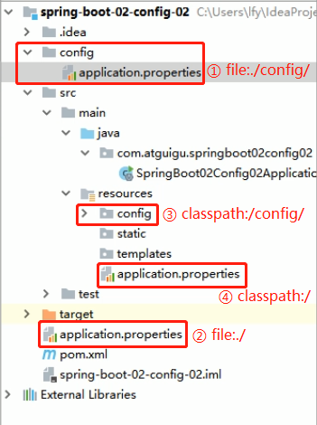


### 1. spring.config.location 配置

项目打包好以后，我们也可以使用命令行参数的形式，在启动项目的时候来指定配置文件的新位置

运行参数指定的配置文件和默认文件功能形成互补配置

**命令行运行时指定的配置文件配置，优先级最高**

```shell
java -jar com.yourapp.jar --spring.config.location=/usr/local/yourApp-config.properties
```


### 2. 外部配置加载顺序

Spring Boot 也可以从以下位置加载配置，**优先级从高到低，同样高优先级的配置覆盖低优先级的配置，所有配置文件的配置形成互补配置**

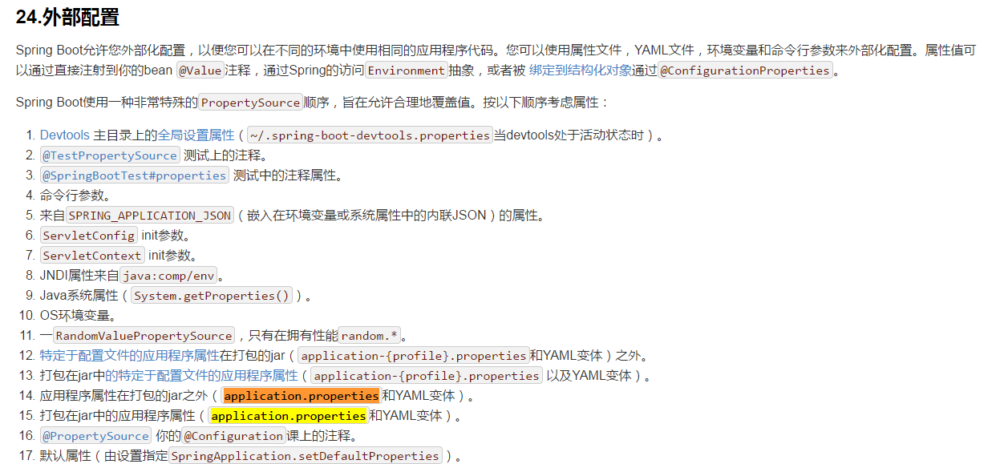

> 所有支持的配置加载来源，参考：https://docs.spring.io/spring-boot/docs/2.1.1.RELEASE/reference/htmlsingle/#boot-features-external-config
>


## 10. Spring boot 自动配置原理


****


## 参考

[P9、尚硅谷_SpringBoot_配置-yaml简介](https://www.bilibili.com/video/av36291265/?p=9)

[P10、尚硅谷_SpringBoot_配置-yaml语法](https://www.bilibili.com/video/av36291265/?p=10)

[P11、尚硅谷_SpringBoot_配置-yaml配置文件值获取](https://www.bilibili.com/video/av36291265/?p=11)

[P12、尚硅谷_SpringBoot_配置-properties配置文件编码问题](https://www.bilibili.com/video/av36291265/?p=12)

[P13、尚硅谷_SpringBoot_配置-@ConfigurationProperties与@Value区别](https://www.bilibili.com/video/av36291265/?p=13)

[P14、尚硅谷_SpringBoot_配置-@PropertySource、@ImportResource、@Bean](https://www.bilibili.com/video/av36291265/?p=14)

[P15、尚硅谷_SpringBoot_配置-配置文件占位符](https://www.bilibili.com/video/av36291265/?p=15)

[P16、尚硅谷_SpringBoot_配置-Profile多环境支持](https://www.bilibili.com/video/av36291265/?p=16)

[P17、尚硅谷_SpringBoot_配置-配置文件的加载位置](https://www.bilibili.com/video/av36291265/?p=17)

[P18、尚硅谷_SpringBoot_配置-外部配置加载顺序](https://www.bilibili.com/video/av36291265/?p=18)

[P19、尚硅谷_SpringBoot_配置-自动配置原理](https://www.bilibili.com/video/av36291265/?p=19)

[P20、尚硅谷_SpringBoot_配置-@Conditional&自动配置报告](https://www.bilibili.com/video/av36291265/?p=20)