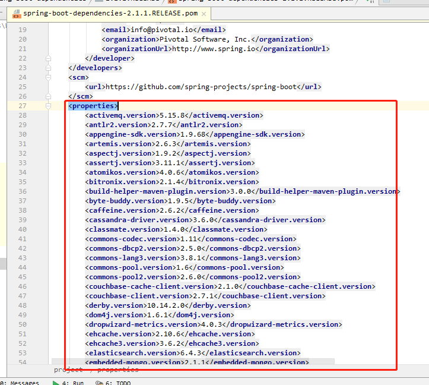

# Spring Boot 入门

##  1. Spring Boot 简介

> 简化 Spring 应用开发的一个框架
> 整合 Spring 技术栈的一个大整合
> J2EE开发的一站式解决方案


## 2. 微服务

> In short, the microservice architectural style is an approach to developing a single application as a **suite of small services**, each **running in its own process** and communicating with lightweight mechanisms, often an HTTP resource API. These services are **built around business capabilities** and **independently deployable** by fully automated deployment machinery. There is a **bare minimum of centralized management** of these services, which may be written in different programming languages and use different data storage technologies.
>
> -- James Lewis and Martin Fowler
>
> 简单来说，微服务架构风格是一种将一个单一应用程序开发为一组小型服务的方法，每个服务运行在自己的进程中，服务间通信采用轻量级通信机制(通常用HTTP资源API)。这些服务围绕业务能力构建并且可通过全自动部署机制独立部署。这些服务共用一个最小型的集中式的管理，服务可用不同的语言开发，使用不同的数据存储技术。
>
> 引自： [Microservices Resource Guide](https://martinfowler.com/microservices/#what)


每一个功能元素最终都是一个可独立替换和独立升级的软件单元


## 3. 环境准备

- jdk 1.8

- maven3.x
- IntelliJ IDEA 2017
- Spring Boot 2.1.1.RELEASE


## 4. Spring Boot HelloWorld

**实例项目**

> 创建一个 `/hello` 服务, 服务器接受请求后, 返回 `Hello World` 字符串

### 1. 创建一个 Maven 项目 (jar)


### 2. 导入Spring Boot 相关依赖

```xml
/* pom.xml */

<!-- Inherit defaults from Spring Boot -->
<parent>
    <groupId>org.springframework.boot</groupId>
    <artifactId>spring-boot-starter-parent</artifactId>
    <version>2.1.1.RELEASE</version>
</parent>

<!-- Add typical dependencies for a web application -->
<dependencies>
    <dependency>
        <groupId>org.springframework.boot</groupId>
        <artifactId>spring-boot-starter-web</artifactId>
    </dependency>
</dependencies>
```


### 3. 编写主程序入口, 启动 Spring Boot 应用

```java
/* HelloWorldMainApplication.java */

/**
 * @SpringBootApplication 标注一个主程序类, 说明这是一个 spring boot 应用
 */
@SpringBootApplication
public class HelloWorldMainApplication {
    public static void main(String[] args) {
        
        // 启动 Spring 应用
        SpringApplication.run(HelloWorldMainApplication.class);
    }
}
```


### 4. 编写 Controller , Service 相关具体业务逻辑

```java
/* WelcomeController.java */

@Controller
public class WelcomeController {

    @ResponseBody
    @RequestMapping("/hello")
    public String Hello() {
        return "Hello World";
    }
}
```

### 5. 运行主程序测试


### 6. 简化部署

导入maven 插件, 将应用打成 **jar** 包

```xml
/* pom.xml */

<!-- Package as an executable jar -->
<build>
    <plugins>
        <plugin>
            <groupId>org.springframework.boot</groupId>
            <artifactId>spring-boot-maven-plugin</artifactId>
        </plugin>
    </plugins>
</build>
```

可以将，打包出来的 **jar**文件，复制到任何地方，直接使用 java 命令执行，启动程序

```bash
> java -jar parent-1.0-SNAPSHOT.jar
```


## 5. Hello World 探究

### 1. POM 文件

#### 1. 父项目

pom.xml 文件中配置了 项目的父项目 **spring-boot-starter-parent**

```xml
/* pom.xml */
<!-- Inherit defaults from Spring Boot -->
<parent>
    <groupId>org.springframework.boot</groupId>
    <artifactId>spring-boot-starter-parent</artifactId>
    <version>2.1.1.RELEASE</version>
</parent>
```

而 **spring-boot-starter-parent** 的父项目是 **spring-boot-dependencies**

```xml
<parent>
    <groupId>org.springframework.boot</groupId>
    <artifactId>spring-boot-dependencies</artifactId>
    <version>2.1.1.RELEASE</version>
    <relativePath>../../spring-boot-dependencies</relativePath>
</parent>
```

**spring-boot-dependencies** - **版本仲裁中心**， 用来管理 Spring Boot 应用里面所有版本依赖。

以后导入依赖默认则不需要声明版本号 (*`没有在 dependencies 里面管理的依赖, 还是需要声明版本号`*)




#### 2. 启动器

```xml
<!-- Add typical dependencies for a web application -->
<dependencies>
    <dependency>
        <groupId>org.springframework.boot</groupId>
        <artifactId>spring-boot-starter-web</artifactId>
    </dependency>
</dependencies>
```


**spring-boot-starter-*** - spring boot 场景启动器 [Spring Boot 启动器列表](https://docs.spring.io/spring-boot/docs/2.1.1.RELEASE/reference/htmlsingle/#using-boot-starter)

**spring-boot-starter-web** - 帮我们导入了web 模块正常运行所依赖的组件


### 2. 程序主入口

[Spring Boot 场景启动器 & 自动配置 讲解视频](https://www.bilibili.com/video/av36291265/?p=7)

```java
/* HelloWorldMainApplication.java */

/**
 * @SpringBootApplication 标注一个主程序类, 说明这是一个 spring boot 应用
 */
@SpringBootApplication
public class HelloWorldMainApplication {
    public static void main(String[] args) {
        
        // 启动 Spring 应用
        SpringApplication.run(HelloWorldMainApplication.class);
    }
}
```

**@SpringBootApplication** - Spring Boot 应用标识在某个类上, 则说明这个类是SpringBoot 的主配置类, Spring Boot 就会执行这个类的 `main` 方法来启动应用程序


## 参考

[Spring Boot Reference](https://docs.spring.io/spring-boot/docs/2.1.1.RELEASE/reference/htmlsingle/)

[尚硅谷Java视频教程_Spring Boot视频教程（上）核心技术篇](https://www.bilibili.com/video/av36291265/?p=5)

[Microservices Resource Guide](https://martinfowler.com/microservices)

[Microservices Resource Guide 中文翻译](http://blog.cuicc.com/blog/2015/07/22/microservices/)

[@SpringBootApplication注解解析](https://www.cnblogs.com/question-sky/p/9414057.html)