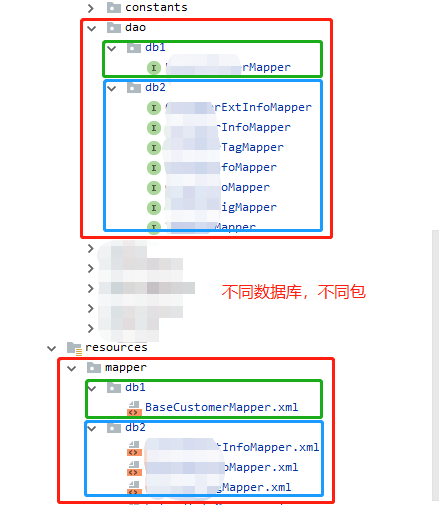

# [Spring Boot 实训]  Mabatis 多数据库

[TOC]

## 原理

<待续>

## 实现

### 1. 多数据源 application.properties 配置

```properties
# db1
spring.datasource.db1.driver-class-name=com.mysql.jdbc.Driver
spring.datasource.db1.jdbc-url=jdbc:mysql://127.0.0.1:3306/db1?useSSL=false
spring.datasource.db1.username=root
spring.datasource.db1.password=123456
# db2
spring.datasource.db2.driver-class-name=com.mysql.jdbc.Driver
spring.datasource.db2.jdbc-url=jdbc:mysql://127.0.0.1:3306/db2?useSSL=false
spring.datasource.db2.username=root
spring.datasource.db2.password=123456
```

> 注意：链接单个数据库时，配置中一般为 **spring.datasource.url**，而多数据时，需要改为 **spring.datasource.db1.jdbc-url**  
> 参考：[jdbcUrl is required with driverClassName错误解决](https://blog.csdn.net/newbie_907486852/article/details/81391525)
> 	     [spring.datasource.url与spring.datasource.jdbc-url](https://blog.csdn.net/qq_22156459/article/details/80283054)


### 2. xxxMapper.java 与 xxxMapper.xml 位置




### 3. 多数据源配置定义类  DataSourceConfig.java

其中 `@ConfigurationProperties` 注解中的 `prefix` 参数，与 `application.properties` 配置文件中，定义不同数据源的修饰前缀，保持一致。

```java
# DataSourceConfig.java

import org.springframework.beans.factory.annotation.Qualifier;
import org.springframework.boot.context.properties.ConfigurationProperties;
import org.springframework.boot.jdbc.DataSourceBuilder;
import org.springframework.context.annotation.Bean;
import org.springframework.context.annotation.Configuration;
import org.springframework.context.annotation.Primary;

import javax.sql.DataSource;

@Configuration
public class Db1DataSourceConfig {

    // db1 datasource
    @Primary
    @Bean(name = "Db1DataSource")
    @Qualifier("Db1DataSource")
    @ConfigurationProperties(prefix = "spring.datasource.db1")
    public DataSource Db1DataSource() {
        return DataSourceBuilder.create().build();
    }

    // db1 datasource
    @Bean(name = "Db2DataSource")
    @Qualifier("Db2DataSource")
    @ConfigurationProperties(prefix = "spring.datasource.db2")
    public DataSource Db2DataSource() {
        return DataSourceBuilder.create().build();
    }
}
```


### 4. Mybatis 配置

> 1. 注入的 `DataSource` 对应使用在 `DataSourceConfig.java` 中定义好的对应数据库对象
> 2. `@MapperScan` 参数 `basePackages` 指定 `mapper` 扫描目录
> 3. `db2` 与 `db1`  Mybatis 配置类内容相同，只需要将其中 `db1` 换作 `db2` 即可 

```java
# Db1MybatisConfig.java

import org.apache.ibatis.session.SqlSessionFactory;
import org.mybatis.spring.SqlSessionFactoryBean;
import org.mybatis.spring.SqlSessionTemplate;
import org.mybatis.spring.annotation.MapperScan;
import org.springframework.beans.factory.annotation.Autowired;
import org.springframework.beans.factory.annotation.Qualifier;
import org.springframework.context.annotation.Bean;
import org.springframework.context.annotation.Configuration;
import org.springframework.core.io.support.PathMatchingResourcePatternResolver;

import javax.sql.DataSource;

@Configuration
@MapperScan(basePackages = {"com.dahanis.crm.domain.dao.db1"}, sqlSessionFactoryRef = "sqlSessionFactoryDb1")
public class MybatisConfigDb1 {

    @Autowired
    @Qualifier("Db1DataSource")
    private DataSource Db1DataSource;

    @Bean
    public SqlSessionFactory sqlSessionFactoryDb1() throws Exception {
        SqlSessionFactoryBean factoryBean = new SqlSessionFactoryBean();
        factoryBean.setDataSource(Db1DataSource);
        factoryBean.setMapperLocations(new PathMatchingResourcePatternResolver().getResources("classpath:mapper/db1/*.xml"));

        return factoryBean.getObject();
    }

    @Bean
    public SqlSessionTemplate sqlSessionTemplateDb1() throws Exception {
        SqlSessionTemplate template = new SqlSessionTemplate(sqlSessionFactoryDb1());
        return template;
    }
}
```


### 5. 应用程序启动入口类

`SpringBootApplication` 注解中，设置 `exclude` 参数，包含 `DataSourceAutoConfiguration` 自动配置类

```java
@SpringBootApplication(scanBasePackages = {"com.xxx.xxx"}, exclude = {DataSourceAutoConfiguration.class})
public class ApiMainApplication extends SpringBootServletInitializer {
    ...
}
```


## 源码

<待续>

## 参考

[Spring Boot多数据源配置与使用 - 简书](https://www.jianshu.com/p/34730e595a8c)