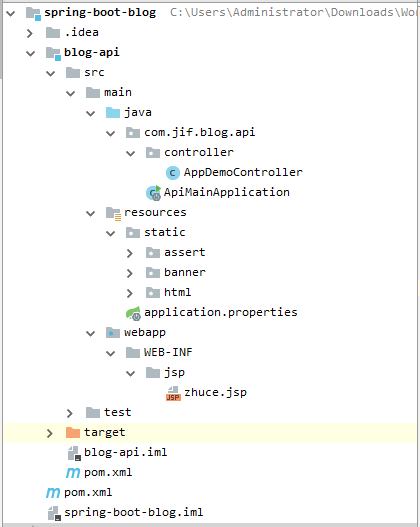
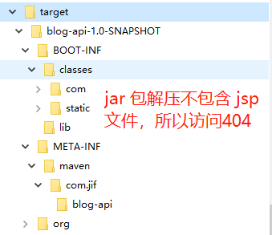
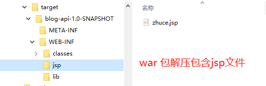
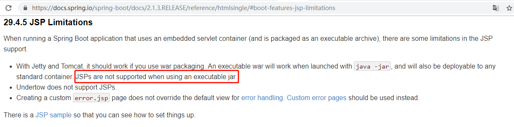

# [Spring Boot 实训] 启动

> 官
>
> 方文档：https://docs.spring.io/spring-boot/docs/2.1.3.RELEASE/reference/htmlsingle/#boot-features-jsp-limitations
>
> Jsp 使用实例：https://github.com/spring-projects/spring-boot/tree/v2.1.3.RELEASE/spring-boot-samples/spring-boot-sample-web-jsp

## 参考

[Spring Boot干货系列：（五）开发Web应用之JSP篇](http://tengj.top/2017/03/13/springboot5/)