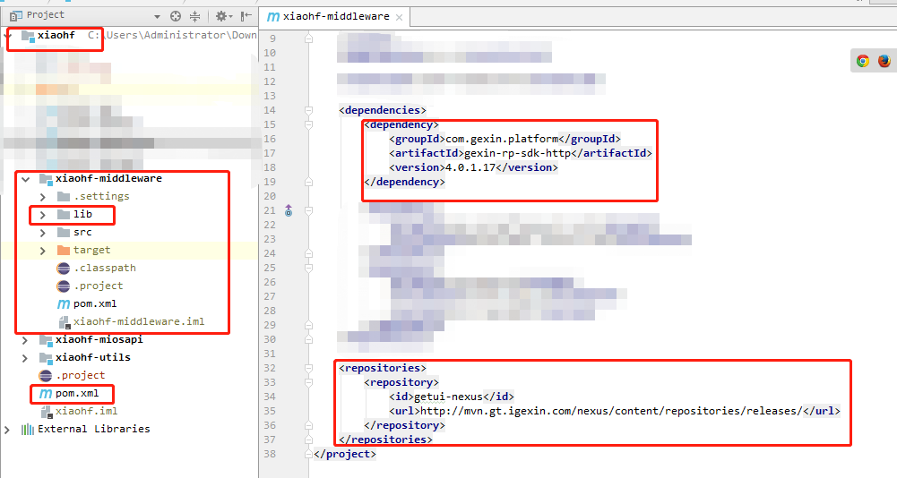

# springboot工程maven打包时,如果有依赖工程总是报找不到,解决办法

最近公司使用springboot开发项目，使用的构建工具是maven,项目分了很多模块，并且模块之间还存在一定的依赖，比如说一个项目common是提供各项目通用的工具类，公共的类等

例子：项目root,有module common,front,mall等其中front 和mall都依赖于common，将来需要上线部署的也是front和mall项目,所以两个项目是要进行打包，也就是这个打包操作，让我浪费了好多时间，这里都是我亲身经历的血泪史。。

当使用Maven对front项目直接进行package时，提示依赖于common的jar包找不到。因为直接对front打包，common并没有被打包，依赖关系无法保持。这时你要做的就是，首先对项目common进行install，如图

注意！注意！这里有一个巨坑，我已经义无反顾的跳进去一次了，大家一定不要再往里面跳了：Common打包出来的应该是不可执行的jar包，所以不要在Common的pom中定义spring-boot-maven-plugin插件，因为这个SpringBoot插件会在Maven的package后进行二次打包，目的为了生成可执行jar包，如果C中定义了这个插件，会报错提示没有找到main函数。

这时你就可以去打包front项目了，当然打包的时候可能还是不行，**这里还有一个小坑，如果还是不能进行打包的话，那么就install一下root项目，也就是总目录下的pom文件对应的install操作，这样再打包front项目基本上就没有问题了**，

老铁，都是经验呀，希望对你们有帮助

## ## 参考

https://blog.csdn.net/y_hai_yang/article/details/81004451