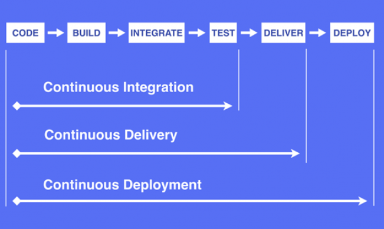

# 持续集成 & 持续交付 & 持续部署

假如把开发工作流程分为以下几个阶段：

**编码 -> 构建 -> 集成 -> 测试 -> 交付 -> 部署**

正如你在上图中看到，「**持续集成**(Continuous Integration)」、「**持续交付**(Continuous Delivery)」和「**持续部署**(Continuous Deployment)」有着不同的软件自动化交付周期。

- **持续集成** 指的是，**频繁地 (一天多次) 将代码集成到主干**。持续集成的目的，就是**让产品可以快速迭代，同时还能保持高质量**。
- **持续交付**指的是，**频繁地将软件的新版本，交付给质量团队或者用户，以供评审**。如果评审通过，代码就进入生产阶段。它强调的是，**不管怎么更新，软件是随时随地可以交付的**。
- **持续部署**是持续交付的下一步，指的是**代码通过评审以后，自动部署到生产环境**。它强调的是**代码在任何时刻都是可部署的，可以进入生产阶段**。

## 参考

[基于Jenkins Pipeline的ASP.NET Core持续集成实践](https://www.cnblogs.com/edisonchou/p/edc_aspnetcore_jenkins_pipeline_introduction.html)

[持续集成,持续交付,持续部署之间的区别](https://www.cnblogs.com/itzhazha/articles/6478898.html)